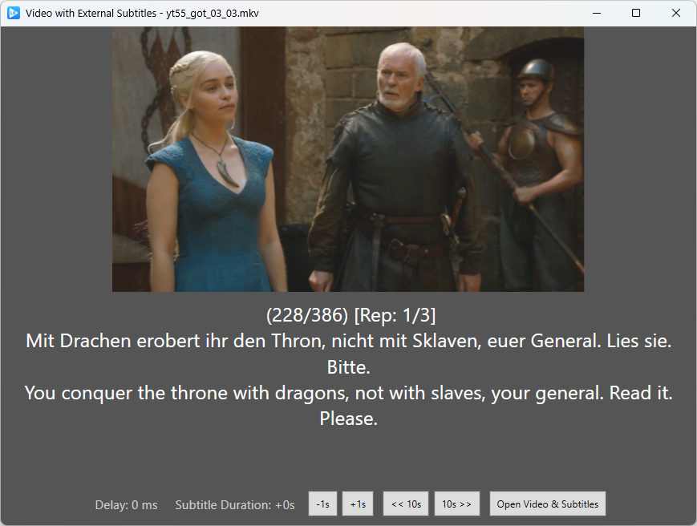

# LR Player WPF

LR Player WPF is a Windows app built with WPF (Windows Presentation Foundation). It's part of the LangRepeater German learning stack ([github.com/konstantin-eu/langrepeater](https://github.com/konstantin-eu/langrepeater)).

This video player supports subtitles and includes the following features:
- Each subtitle is repeated 3 times.
- Rewind to the next/previous subtitle.

## Build
Built with Visual Studio 2022 or JetBrains Rider.

### Brightness Change
The brightness adjustment uses a Pixel Shader (HLSL code). Compile it from the Windows command line:

```
"C:\Program Files (x86)\Windows Kits\10\bin\10.0.22621.0\x86\fxc.exe" /T ps_2_0 /E main /Fo Resources/BrightnessShader.ps BrightnessShader.fx
```

## Controls
Use the right/left arrow keys to rewind to the next/previous subtitle.

## Tested Video Format
The app has been tested with videos in the following format:

**Stream 0**
- Codec: H264 - MPEG-4 AVC (part 10) (avc1)
- Type: Video
- Video resolution: 1280x720
- Buffer dimensions: 1280x720
- Frame rate: 30.000300
- Decoded format:
    - Orientation: Top left
    - Color primaries: ITU-R BT.709
    - Color transfer function: ITU-R BT.709
    - Color space: ITU-R BT.709 Range
    - Chroma location: Left

**Stream 1**
- Codec: MPEG AAC Audio (mp4a)
- Type: Audio
- Channels: Stereo
- Sample rate: 48000 Hz
- Bits per sample: 32

## App Screenshots


## Note on Code Generation
Parts of this project were programmed with the assistance of a large language model (LLM). As such, some code may not reflect standard best practices or optimal design choices. Contributions and improvements are welcome!

## Contact
Feel free to reach out!  
Email: [langrepeater@gmail.com](mailto:langrepeater@gmail.com)